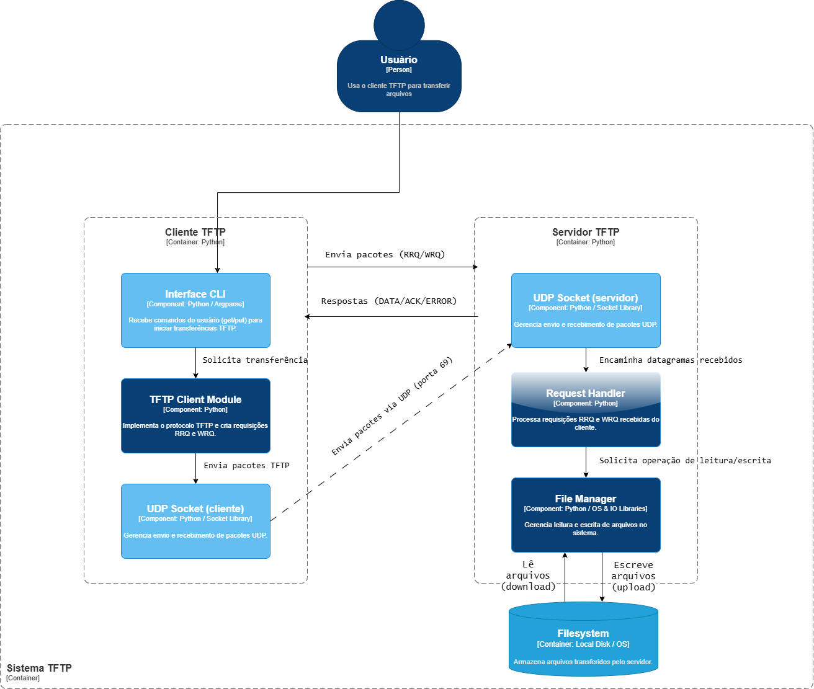
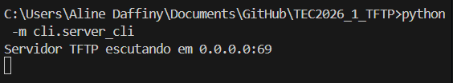
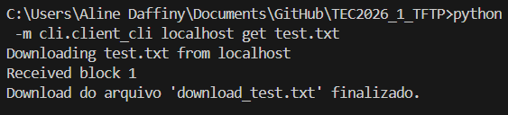
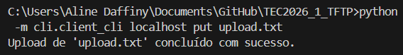
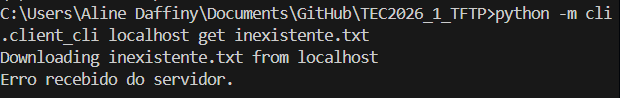
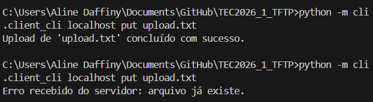
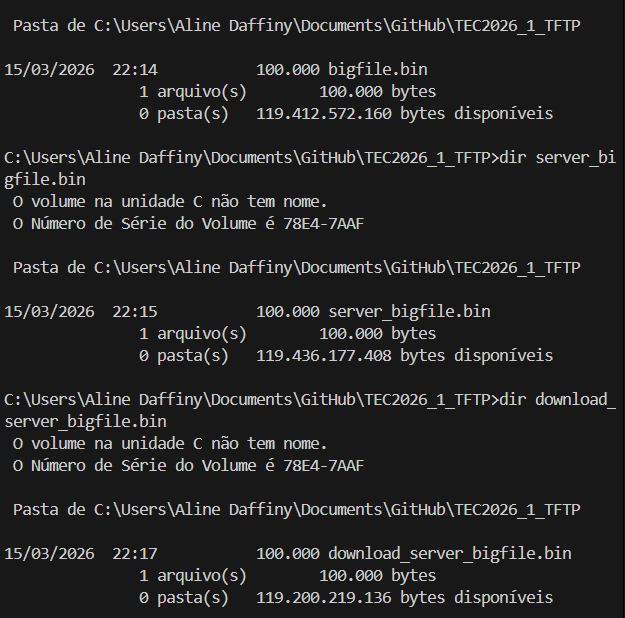
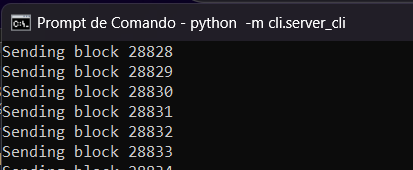
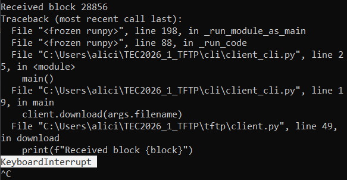
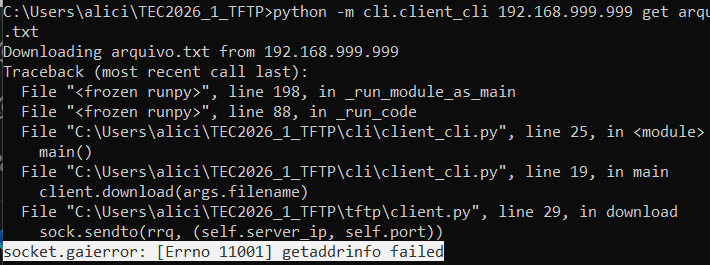

# Projeto TFTP (Trivial File Transfer Protocol) -- Atividade 002


Este projeto consiste na implementação de um **cliente e servidor TFTP
desenvolvidos em Python**, seguindo as especificações da **RFC 1350**.

O sistema permite realizar **transferências de arquivos utilizando
comunicação UDP**, implementando o fluxo de mensagens do protocolo
**TFTP (RRQ, WRQ, DATA, ACK e ERROR)**.

A arquitetura do sistema foi modelada utilizando o **modelo C4 de
arquitetura de software**, especificamente no **nível 3 (Component
Diagram)**.

------------------------------------------------------------------------

# 📑 Índice

-   Arquitetura do Sistema
-   Componentes do Sistema
-   Fluxo de Comunicação
-   Tecnologias Utilizadas
-   Estrutura do Projeto
-   Como Executar
-   Testes
-   Referências

------------------------------------------------------------------------

## Contribuições da equipe

### Diagrama de Componentes (C4)
- Rafael Santos
- Ana Beatriz

### Servidor TFTP
- Aglison
- Benício Mozan

### Cliente TFTP e Testes
- Daffiny Gomes
- Alicia Benedetto

------------------------------------------------------------------------

# 🏗️ Arquitetura do Sistema (Modelo C4 - Nível 3)



O diagrama acima apresenta a arquitetura de componentes do sistema TFTP,
mostrando a separação entre cliente, servidor e armazenamento.

------------------------------------------------------------------------

# 🔍 Detalhamento dos Componentes

## Cliente TFTP

-   **Interface CLI**
    -   Responsável por receber comandos do usuário via terminal.
    -   Permite executar operações de transferência utilizando os
        comandos:
        -   `get` -- baixar arquivo do servidor
        -   `put` -- enviar arquivo ao servidor.
-   **TFTP Client Module**
    -   Implementa a lógica central do protocolo TFTP.
    -   Responsável por criar requisições:
        -   **RRQ (Read Request)** -- leitura de arquivo
        -   **WRQ (Write Request)** -- envio de arquivo.
    -   Gerencia o fluxo de pacotes **DATA, ACK e ERROR**.
-   **UDP Socket (Cliente)**
    -   Responsável pelo envio e recebimento de datagramas UDP.
    -   Realiza a comunicação com o servidor através da rede.

------------------------------------------------------------------------

## Servidor TFTP

-   **UDP Socket (Servidor)**
    -   Escuta requisições iniciais na **porta UDP 69**.
    -   Gerencia a comunicação com clientes utilizando **portas
        efêmeras** durante a transferência.
-   **Request Handler**
    -   Processa requisições **RRQ** e **WRQ** enviadas pelo cliente.
    -   Coordena o fluxo de comunicação entre cliente e servidor.
-   **File Manager**
    -   Responsável pela leitura e escrita de arquivos no sistema
        operacional.
    -   Interage diretamente com o **filesystem**.

------------------------------------------------------------------------

## Armazenamento

-   **Filesystem**
    -   Representa o armazenamento local no sistema operacional.
    -   Responsável por manter os arquivos transferidos de forma
        persistente.

------------------------------------------------------------------------

# 🔄 Fluxo de Comunicação do Protocolo

O fluxo básico do protocolo TFTP ocorre da seguinte forma:

1.  O cliente envia uma requisição **RRQ** (download) ou **WRQ**
    (upload) para o servidor na **porta UDP 69**.
2.  O servidor responde utilizando **uma porta efêmera** para a
    transferência.
3.  A transferência ocorre através da troca de pacotes:
    -   **DATA**
    -   **ACK**
    -   **ERROR**
4.  Os dados recebidos são armazenados no **filesystem do servidor**.

------------------------------------------------------------------------

# 🛠️ Tecnologias e Padrões Utilizados

## Ferramenta para modelagem de diagramas

-   Drawio

## Linguagem

-   Python 3

## Bibliotecas utilizadas

-   argparse -- construção da interface de linha de comando (CLI)
-   socket -- comunicação via UDP
-   os / io -- manipulação de arquivos no sistema operacional

## Padrões de Código

-   Código desenvolvido seguindo a **PEP 8**

## Controle de Versão

-   Git
-   Integração de código através de **Pull Requests**

------------------------------------------------------------------------

# 📂 Estrutura do Projeto

    tftp-project/
    │
    ├── tftp/
    │   └── lógica do protocolo TFTP
    │
    ├── cli/
    │   ├── client_cli.py
    │   └── server_cli.py
    │
    ├── tests/
    │   └── testes do sistema
    │
    ├── docs/
    │   └── c4-tftp-diagram.png
    │
    └── README.md

------------------------------------------------------------------------

# 🚀 Como Executar o Projeto

## Iniciar o servidor

``` bash
python -m cli.server_cli
```

## Executar o cliente

### Baixar arquivo do servidor

``` bash
python -m cli.client_cli 127.0.0.1 get arquivo.txt
```

### Enviar arquivo para o servidor

``` bash
python -m cli.client_cli.py 127.0.0.1 put arquivo.txt
```

### Estrutura do comando

    python cli/client_cli.py <ip_servidor> <comando> <arquivo>

Exemplo:

    python cli/client_cli.py 127.0.0.1 get arquivo.txt

------------------------------------------------------------------------

# 🧪 Testes Realizados

Os testes foram realizados utilizando clientes TFTP padrão para validar
a interoperabilidade do protocolo.

### Windows

Cliente TFTP nativo:

    tftp

### Linux / macOS

Cliente TFTP via terminal:

    tftp

## Roteiro de testes

1. Iniciar o servidor.
2. Download e Upload com o cliente.
3. Testar resposta a arquivos inexistentes.
4. Testar resposta a arquivos duplicados.
5. Testar robustez da transferência.

### Resultados

- **T01. Iniciar o servidor**
O servidor inicia corretamente  
  

- **T02. Download e Upload com o cliente**  
O download (get) de arquivos funciona corretamente:  
  
Bem como o upload (put) de arquivos:  
  

- **T03. Testar resposta a arquivos inexistentes**  
Após alguns ajustes, o servidor envia corretamente o "erro 5" para o cliente, identificando que o arquivo solicitado não existe.  
  

- **T04. Testar resposta a arquivos duplicados**  
Inicialmente o servidor também falhou nesse teste. O comportamento esperado seria de um alerta que o arquivo já existe, entretanto o arquivo estava somente sendo sobrescrito. A condição de verificação de duplicidade foi implementada e o agora funciona corretamente.  
  

- **T05. Testar robustez da transferência**  
O servidor foi testado com arquivos de dois tamanhos: 100kb e 50mb. O arquivo de 100kb passou pelo teste, porém o de 50mb precisou que houvesse pequenos ajustes. O contador de blocos foi refatorado para aceitar mais de 65535 blocos, e então o upload foi realizado corretamente.  
Foi verificado também a integridade dos arquivos, tanto no upload quanto no download. Em ambos os arquivos não houve perda de informação.  
  

- **T06. Teste de timeout na transferência**  
Durante a transferência de um arquivo de grande porte, o servidor foi interrompido manualmente utilizando o comando Ctrl + C, com o objetivo de simular uma falha de comunicação durante a transmissão dos dados. No início do processo, o cliente estava recebendo os blocos normalmente, conforme mostrado abaixo:



Após a interrupção do servidor, a transferência foi interrompida abruptamente e não foi concluída com sucesso, conforme indicado pela mensagem de interrupção:



Esse comportamento demonstra que o sistema depende de comunicação contínua entre cliente e servidor, e que qualquer interrupção impede a conclusão correta da transferência.

- **T07. Teste de conexão com IP inválido**  
Foi realizada uma tentativa de conexão com um endereço IP inválido. O sistema respondeu com erro de resolução de endereço (`getaddrinfo failed`), indicando que o IP fornecido não é válido. Esse comportamento demonstra que o cliente trata corretamente entradas inválidas, evitando travamentos ou execução indevida.  



------------------------------------------------------------------------

# 🔗 Referências

-   https://en.wikipedia.org/wiki/Trivial_File_Transfer_Protocol
-   https://datatracker.ietf.org/doc/html/rfc1350
-   https://www.geeksforgeeks.org/git/git-pull-request/
